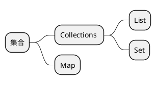

<link rel="stylesheet" href="http://rbr3i8xre.hd-bkt.clouddn.com/css/local.css" type="text/css">

> [!TIP]
> 本栏主要是收纳个人创造、学习总结的文章。力在记录学习历程、偶时感悟，便于日后拾遗、复盘和使用。
>  **本栏的核心方向**：
> + 基础理论、环境搭载记录、java后端、重构经验、常用前端、项目总结。

# 环境搭建
> + [docker手册](article/environment/docker.md)
> + [node安装](article/environment/node.md)
> + [git使用](article/environment/git.md)
> + [manjaro尝鲜](article/environment/manjaro.md)

# 基础知识

## 计算机
> + [操作系统](article/basis/operating_system.md)
> + [计算机网络](article/basis/network.md)
> + [linux通识](article/basis/linux.md)

## 数据结构
<!-- tabs:start -->
#### **线性表**

#### **链式表**

#### **树**

<!-- tabs:end -->

## 算法实录
## 重构和设计模式

# java
<!-- tabs:start -->
#### **集合**

#### **流式**

#### **多线程**

#### **函数式**

#### **JVM**

<!-- tabs:end -->
