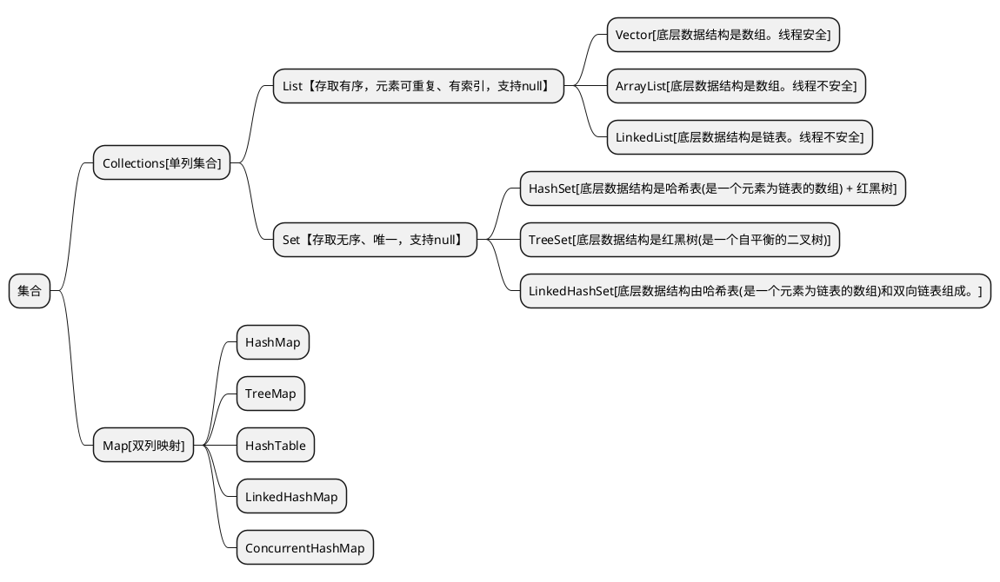

<link rel="stylesheet" href="https://lizhuo-file.oss-cn-hangzhou.aliyuncs.com/docsify-note/css/local.css" type="text/css">

> [!TIP]
> 本栏主要是收纳个人创造、学习总结的文章。力在记录学习历程、偶时感悟，便于日后拾遗、复盘和使用。
>  **本栏的核心方向**：
> + 基础理论、环境搭载记录、java后端、重构经验、常用前端、项目总结。

# 🌏 环境搭建
> + [docker手册](article/environment/docker.md)
> + [node安装](article/environment/node.md)
> + [git使用](article/environment/git.md)
> + [manjaro尝鲜](article/environment/manjaro.md)

# 🛰️ 基础知识

## 💻 计算机
> + [操作系统](article/basis/operating_system.md)
> + [计算机网络](article/basis/network.md)
> + [linux通识](article/basis/linux.md)

## 🎰 数据结构
<!-- tabs:start -->
#### **线性表**

#### **链式表**

#### **树**

<!-- tabs:end -->

## 🧮 算法实录

## 🧱 重构和设计模式

# ☕ java
<!-- tabs:start -->
#### **集合**

+ [Collection](article/java/java_collection.md?id=collection)
+ [Map](article/java/java_collection.md?id=map)

#### **流式**

#### **多线程**

#### **函数式**

#### **JVM**

#### **锁**

#### **源码API**

#### **面典**

<!-- tabs:end -->

# 🛢️ 数据库
> + [MySQL](article/database/MySQL.md)
> + [Redis](article/database/Redis.md)

# 🛴 框架
<!-- tabs:start -->
#### **View**

#### **Spring**

#### **ORM**
> + [Mybatis](article/frame/mybatis.md)
#### **RPC**

#### **MQ**

**消息**指的是两个应用间传递的数据。

MQ(message queue)消息队列是一种跨进程的通信机制，用于上下游传递消息。MQ通常可起到如下作用：

+ 流量消峰
+ 应用解耦
+ 异步处理

> + RabbitMQ

#### **Search**

<!-- tabs:end -->
