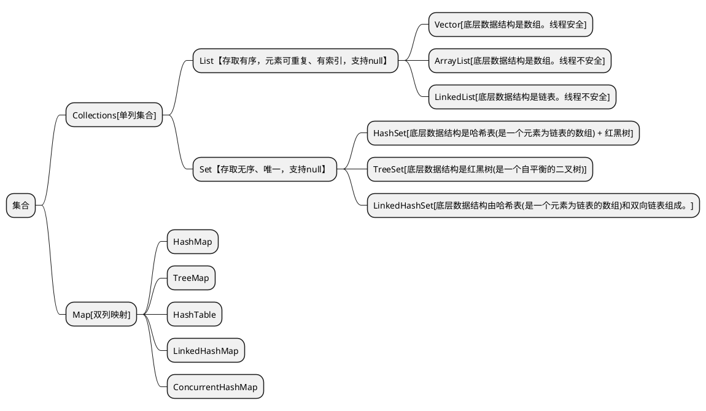

<link rel="stylesheet" href="https://lizhuo-file.oss-cn-hangzhou.aliyuncs.com/docsify-note/css/local.css" type="text/css">

> [!TIP]
> 本栏主要是收纳个人创造、学习总结的文章。力在记录学习历程、偶时感悟，便于日后拾遗、复盘和使用。
>  **本栏的核心方向**：
> + 基础理论、环境搭载记录、java后端、重构经验、常用前端、项目总结。

# 🌏 环境搭建
> + [docker手册](article/environment/docker.md)
> + [node安装](article/environment/node.md)
> + [git使用](article/environment/git.md)

# 🛰️ 基础知识

## 💻 计算机
<!-- tabs:start -->
#### **操作系统**

> + [进程管理](article/computer/os/process_management/process.md)
> + [内存管理]()
> + [磁盘管理]()
#### **计算机网络**

#### **linux通识**

<!-- tabs:end -->

## 🎰 数据结构
<!-- tabs:start -->
#### **线性表**

#### **链式表**

#### **树**

<!-- tabs:end -->

## 🧮 算法实录
<!-- tabs:start -->
#### **排序**
> + [排序](article/algorithm/sort.md)
#### **查找**
> + [查找](article/algorithm/search.md)

<!-- tabs:end -->

## 🧱 重构和设计模式
<!-- tabs:start -->
#### **UML类图**

<!-- tabs:end -->

# ☕ java
<!-- tabs:start -->
#### **异常**
> + [异常](article/java/java_exception.md)
#### **注解**
> + [注解](article/java/java_annotation.md)
#### **反射&代理**
> + [反射](article/java/java_reflex.md)
> + [静态代理]()
> + [动态代理]()
#### **IO**

#### **集合**

+ [Collection](article/java/java_collection.md?id=collection)
    + [List](article/java/java_collection.md?id=list)
    + [Set](article/java/java_collection.md?id=set)
+ [Map](article/java/java_collection.md?id=map)

#### **函数式**

#### **多线程**

#### **JVM**
> + [class结构](article/java/jvm/jvm_class_structure.md)
> + [JVM数据模型](article/java/jvm/jvm_data_model.md)
> + [JVM内存模型](article/java/jvm/jvm_memory_model.md)
> + [类加载机制](article/java/jvm/jvm_class_loading.md)
> + [对象创建](article/java/jvm/jvm_object_creating.md)
> + [GC](article/java/jvm/jvm_GC.md)

#### **源码**

<!-- tabs:end -->

# 🛢️ 数据库
<!-- tabs:start -->
#### **MySQL**
> + [MySQL](article/database/MySQL.md)
#### **Redis**
> + [Redis](article/database/Redis.md)
<!-- tabs:end -->

# 🛴 框架
<!-- tabs:start -->
#### **View**

#### **Spring**
> + [Spring](article/frame/spring/spring.md)
> + [SpringMVC](article/frame/spring/springMVC.md)
> + [SpringBoot](article/frame/spring/springBoot.md)
#### **ORM**
> + [Mybatis](article/frame/orm/mybatis.md)
#### **RPC**

#### **MQ**

**消息**指的是两个应用间传递的数据。

MQ(message queue)消息队列是一种跨进程的通信机制，用于上下游传递消息。MQ通常可起到如下作用：

+ 流量消峰
+ 应用解耦
+ 异步处理

> + RabbitMQ

#### **Search**

<!-- tabs:end -->

# ✍️学习总结
<!-- tabs:start -->
#### **1**
> + [我眼中的JavaWeb](article/summary/java_web.md)
<!-- tabs:end -->
