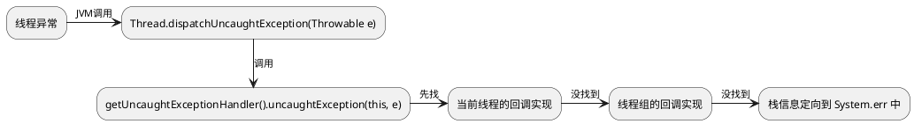

# 线程的创建

java中线程的本质就是从当前运行分支中创建出一个新的**可运行的**分支。所以具体有如下方案：

+ **重写Thread类的run()方法**

  <u>注意使用start( )方法调用，调用run( )方法不会新建线程</u>

  ```java
  public class NewThread extends Thread{
      @Override
      public void run() {
          System.out.println("子线程执行");
      }
      public static void main(String[] args) {
          NewThread thread = new NewThread();
          thread.start();
      }
  }
  ```

+ **重写Runnable接口的run()方法**

  <u>注意使用start( )方法调用，调用run( )方法不会新建线程</u>

  ```java
  public class NewThread {
      public static void main(String[] args) {
          Runnable runnable= () ->{
              System.out.println("子线程执行");
          };
          new Thread(runnable).start();
      }
  }
  ```

+ **重写Callable的call( )方法**

  ```java
  public class NewThread {
      public static void main(String[] args) {
          Callable callable = () -> {
              System.out.println("子线程执行");
              return null;
          };
          //FutureTask可包装Runable和Callable
          FutureTask futureTask = new FutureTask<>(callable);
          futureTask.run();
      }
  }
  ```

+ 线程状态


+ **NEW,新建状态。** 创建了线程对象,在调用 start()启动之前的状态;
+ **RUNNABLE,可运行状态。** 包含:READY 和RUNNING 两个状态. READY 状态可以被线程调度器进行调度并进入RUNNING 状 态 ,Thread.yield()方法可从RUNNING状态转换为 READY 状态。
+ **BLOCKED阻塞状态。**线程发起阻塞的 I/O 操作或者申请由其他线程占用的独占资源（如锁）时会转入BLOCKED 阻塞状态.。处于阻塞状态的线程不会占用CPU资源，当阻塞I/O操作执行完,或者线程获得了其申请的资源,线程可以转换为 RUNNABLE。
+ **WAITING 等待状态。** object.wait(), thread.join()会把线程转换为 WAITING 等待状态, 执行 object.notify()方法,或者加入的线程执行完毕,当前线程会转换为 RUNNABLE 状态。
+ **TIMED_WAITING 状态。**与 WAITING 状态的区别在于处于该状态的线程不会无限的等待,如果该线程在指定的时间内没有完成期望的操作，就会自动转换为 RUNNABLE。
+ **TERMINATED 终止状态。**线程结束或运行完毕。

# 多线程风险和特性

+ **线程安全问题：**多线程的执行顺序是随机的，若并发访问控制不当，就会产生数据一致性问题。主要是由硬件层的内存缓冲区和软件层的JIT编译器的指令重排引起的。**<u>实现线程安全性必须要为共享数据的读和写同时加上同一把锁。</u>**
  
  + **原子性：**可通过锁和CAS指令实现
    + 其他线程只能看到共享变量更改前和更改完毕之后的结果，中间过程值不可见
    + 一组指令同时成功或失败
  + **可见性：**
    + 对共享变量进行更改后，其他线程能立即获得这个新数据
  + **有序性：**序 ==》 内存访问操作的顺序。可以使用 volatile、synchronized 关键字实现有序性
  
+ **线程活性问题：**线程一直处于非可运行状态。
  
  + **死锁：**互相占有独占资源
  
    当线程需要多个锁资源时，保持锁资源顺序一致，可有效解决死锁。
  
  + **锁死：**线程无法唤醒致任务无法进展
  
  + **活锁：**线程一直在做无用功，任务一直无法进展
  
  + **饥饿：**需要的资源一直被占用而无法释放
  
    

# java内存模型


+ 方法执行依赖于CPU，但CPU从不直接从主内存中取数据，而是通过缓存，
+ CPU不能访问其他CPU的寄存器，但能通过缓存一致性协议访问其他CPU的缓存
+ 主内存中的共享数据被A核处理后未刷入缓冲区，若在该数据被刷入缓存之前被B核访问，就会**发生可见性问题**，获取到脏数据。


+ 线程间的共享数据存在主内存
+ 工作内存是线程私有的，它是抽象的，包含上图的缓冲区和寄存器。它存储的是共享数据的副本，且对其他线程不可见

# 线程同步

​		**<u>多线程的并发：一个CPU核心在任意时刻只能为一个线程提供时间片，但是在任意短的时间段内是可以为多个线程提供资源的；在如今多CPU时代下，宏观上是完全有可能同时为多个线程提供时间片的，即并行服务的支持。所以可以认为，多核下的线程是可以同时执行的。</u>**

​		线程同步机制是一套用于协调线程之间的数据访问的机制，用于保障线程安全。Java 平台提供解决方案包括: 锁, volatile 关键字, final 关键字,static 关键字,以及相关的线程调度API,如wait()，notify()等

​		<u>**java线程在执行过程中若出现了异常，会立即中断并释放锁对象，且不会干扰其他线程执行。**</u>

## 锁

​		锁是一种资源，是访问共享数据前的必须条件。持有锁的线程才被允许访问共享数据，访问结束后应当立即释放锁。

+ **原子性：**锁具备互斥性，即一个锁只能同时被一个线程所持有，并以此来保障线程的原子性。
+ **可见性：**在java中，获取锁时会自带刷新CPU缓存，释放锁时会自带将新数据刷入CPU缓存，并以此来保障线程的可见性。
+ **有序性：**

 **锁的可重入性：**

​		指持有该锁的线程可否继续申请该锁。如A( )调用B( ),且A()、B()同时需要a锁，此时若a锁不具备可重入性，程序就会锁死，若a锁具备可重入性，程序就可继续运行。

## synchronized

​		一种互斥锁，可以保证原子性，也可以保证可见性。粒度越细，执行效率越高。

```java
public class NewThread {
    public static void main(String[] args) {
        NewThread o = new NewThread();
        new Thread(() -> {
            o.mm();
        }, "A").start();
        new Thread(() -> {
            o.mm();
        }, "B").start();
    }

    public void mm() {
        synchronized (this) {
            for (int i = 0; i < 100; i++) {
                System.out.println(Thread.currentThread().getName() + " ==== " + i);
            }
        }
    }
}
```

## volatile

​		修饰变量，可令变量的值直接基于主内存读写，仅能够保障可见性。异步非阻塞，效率高

## CAS（比较交换算法）

​		以 i++ 为例，一次循环操作涉及从主内存取值，计算，刷入主内存。CAS的核心在于在刷新主内存之前或获取当前内存中的 i 的值，如果它 和 当前线程 工作内存中的 i 一致 ，即目前无其他线程对 i 进行干扰，才会将新值刷入主内存。

## 原子变量类

​		原子变量类基于CAS实现的, 当对共享变量进行read-modify-write。更新操作时,通过原子变量类可以保障操作的原子性与可见性.

+ 基础数据型 AtomicInteger, AtomicLong, AtomicBoolean
+ 数组型 AtomicIntegerArray,AtomicLongArray,AtomicReferenceArray
+ 字段更新 AtomicIntegerFieldUpdater,AtomicLongFieldUpdater,AtomicReferenceFieldUpdater
+ 引用型 AtomicReference, AtomicStampedReference,AtomicMarkableReference

# 线程通信

## 等待通知机制

当线程A的执行条件不成立时，可将A挂起持续等待，直到其他线程执行后更新了状态并使其满足A的执行后，才将A线程唤醒。

### wait( )

+ 可将当前线程挂起等待，直到被唤醒或者中断。

+ 调用后，当前线程立即暂停转入等待状态，并且释放锁对象。

+ wait( )必须要**<u>由锁对象在临界区调用</u>**，否则有可能会抛异常IllegalMonitorStateException

    ```
     synchronized(锁对象){
     	while(保护条件不成立){
     	//通过锁对象调用wait()方法，暂停当前线程
     	锁对象.wait();
     	}
     	while(保护条件成立){
     		继续执行;
     	}
     }
    ```

### notify() / notifyAll()

+ 它们用于唤醒线程，被唤醒的线程转入阻塞状态，

+ 他不会立即释放锁对象，而是需要等待当前线程的临界区代码执行完毕后才释放锁对象。[即被唤醒线程不会立即执行，而是先转入阻塞，当唤醒线程临界区执行完后，才获取锁，正式执行]

+ notify() / notifyall() 必须要**<u>由锁对象在临界区调用</u>**，否则有可能会抛异常IllegalMonitorStateException

    ```
     synchronized(锁对象){
     	执行 保护条件 的修改代码;
     	//唤醒其他线程
     	锁对象.notify();
     }
    ```

### interrupt( )

能中断线程的等待状态即wait( )等待。其实只要在同步代码块中产生任何异常，导致线程终止，都会释放锁对象。如果中断了睡眠中的线程，会产生 InterruptedException 异常， 同时会清除中断标志。相当于放了个屁，没起啥作用。

## ThreadLocal

等待通知机制的核心思想是控制多线程对共享数据的有序(串行)访问来保证线程安全，好比5个人排队使用一个充电器；而ThreadLocal则是通过对当前线程绑定该线程私有的局部变量，来实现隔离达到线程安全。好比5个人每人兜里都有自己的充电器。

所以对比来看，ThreadLocal是空间换时间，有更好的并发表现；而等待通知机制则是空间换时间，并发效能较差。

ThreadLocal中填充的变量属于当前线程，对其他线程而言是隔离的。ThreadLocal为变量在每个线程中都创建了一个副本，那么每个线程可以访问自己内部的副本变量。

### 简单使用

```java
//1. 创建ThreadLocal实例
ThreadLocal<String> localName = new ThreadLocal();
//2. 设值
localName.set("ABC");
//3. 取值使用
String name = localName.get();
//4. 删除
localName.remove();
```

### 原理

**结构：**

一个 Thread 里面只有一个ThreadLocalMap 【是一个Entry数组，键是一个ThreadLocal，值是该实例设的值 】，而在一个 ThreadLocalMap 里面却可以有很多的 ThreadLocal，每一个 ThreadLocal 都对应一个 value。通过 Thread 调用多个 hreadLocal 来实现存储多值。

​		


**set：**

1. 先从当前线程中取出ThreadLocalMap ，再做为空判断
2. 如果map【数组】为空，就创建一个；不然就直接设值，在插入时会根据ThreadLocal 的hash值确定位置，若预插位置为空就直接插入，若预插位置有值就覆盖旧值。

**get：**

1. 根据ThreadLocal 的hash值确定位置，判断该位置Entry对象中的key是否和get的key一致
2. 一致就返回，不一致就继续查找。

**共享数据：**

```java
private void test() {    
//通过InheritableThreadLocal可实现数据共享
final ThreadLocal threadLocal = new InheritableThreadLocal();       
threadLocal.set("ASD");    
Thread t = new Thread() {        
    @Override        
    public void run() {                    
      Log.i( "asd ==> " + threadLocal.get());        
    }    
  };          
  t.start(); 
} 
```

**内存泄露：**

key为弱引用，GC之后就没了，但对应的value还在，如果value一直得不到回收，就可能发生内存泄露。可在最后使用remove( )解决。

```java
ThreadLocal<String> local = new ThreadLocal();
try {
    local.set("A");
    ……
} finally {
    local.remove();
}
```


# 线程管理

## 线程组

类比文件夹，用于管理文件。默认新建的线程归于父线程同一个线程组。JVM在创建main线程时会为它指定一个线程组。

线程组开始是出于安全的考虑用来区分不同的Applet，然而ThreadGroup并未实现这一目标，如今一般会将一组相关的线程存入一个数组或一个集合中，多数情况下可以忽略线程组。

```
// 返回当前线程组
ThreadGroup mainGroup =Thread.currentThread().getThreadGroup();
//创建一个线程组，纳于所处的父线程组中
ThreadGroup group1 = new ThreadGroup("group1");
//创建一个线程组, 同时指定父线程组
ThreadGroup group2 = new ThreadGroup(mainGroup,"group2");
//创建线程时,可以指定线程所属线程组
Thread t1 = new Thread(group1,()->{},"t1");
```

**API：**

+ activeCount() 返回当前线程组及子线程组中活动线程的数量(近似值)
+ activeGroupCount() 返回当前线程组及子线程组中活动线程组的数量(近似值)
+ int enumerate(Thread[] list) 将当前线程组中的活动线程复制到数组中，重载+false -> 只复制当前线程组的
+ enumerate(ThreadGroup[] list) 将当前线程组及子线程组中的活动线程组复制到数组中，重载+false -> 只复制当前线程组的
+ getMaxPriority() 返回线程组的最大优先级,默认是 10
+ getName() 返回线程组的名称
+ getParent() 返回父线程组
+ interrupt() 中断线程组中所有的线程
+ isDaemon() 判断当前线程组是否为守护线程组
+ list() 将当前线程组中的活动线程打印出来
+ parentOf(ThreadGroup g) 判断当前线程组是否为参数线程组的父线程组
+ setDaemon(boolean daemon) 设置线程组为守护线程组，但是与子线程的守护属性无关联

## 异常控制

比较常用。

+ getDefaultUncaughtExceptionHandler() 获得全局的(默认的)UncaughtExceptionHandler
+ getUncaughtExceptionHandler() 获得当前线程的UncaughtExceptionHandler
+ setDefaultUncaughtExceptionHandler(Thread.UncaughtExceptionHandler eh) 设置全局的 UncaughtExceptionHandler
+ setUncaughtExceptionHandler(Thread.UncaughtExceptionHandler eh)设置当前线程的 UncaughtExceptionHandler




  如果想要获得线程中出现异常的信息,就需要设置线程的UncaughtExceptionHandler。

```java
//1设置线程全局的回调接口
Thread.setDefaultUncaughtExceptionHandler(new Thread.UncaughtExceptionHandler(){
		@Override
		public void uncaughtException(Thread t, Throwable e) {
				System.out.println(t.getName() + "线程产生了异常: " + e.getMessage());
		}
});
new Thread(new Runnable() {
		@Override
		public void run() {
				String txt = null;
				System.out.println( txt.length()); //会产生空指针异常
		}
}).start();
```

## Hook线程

  Hook 线程也称为钩子线程, 当 JVM 退出的时候会执行 Hook 线程。经常在程序启动时创建一个.lock 文件, 用.lock 文件校验程序是否启动,在程序退出(JVM 退出)时删除该.lock 文件, 在 Hook 线程中除了防止重新启动进程外,还可以做资源释放, 尽量避免在 Hook 线程中进行复杂的操作。

```java
//1)注入 Hook 线程,在程序退出时删除.lock 文件
Runtime.getRuntime().addShutdownHook(new Thread(){
		@Override
		public void run() {
				System.out.println("JVM 退出,会启动当前 Hook 线程,在 Hook 线程中删
				除.lock 文件");
				getLockFile().toFile().delete();
		}
});
//2)程序运行时,检查 lock 文件是否存在,如果 lock 文件存在,则抛出异常
if ( getLockFile().toFile().exists()){
		throw new RuntimeException("程序已启动");
}else { //文件不存在,说明程序是第一次启动,创建 lock 文件
				try {
				getLockFile().toFile().createNewFile();
				System.out.println("程序在启动时创建了 lock 文件");
				} catch (IOException e) {
							e.printStackTrace();
				}
}
//模拟程序运行
for (int i = 0; i < 10; i++) {
		System.out.println("程序正在运行");
		try {
				TimeUnit.SECONDS.sleep(1);
		} catch (InterruptedException e) {
				e.printStackTrace();
		}
}
}
private static Path getLockFile(){
		return Paths.get("", "tmp.lock");
}
}

```

## 线程池

线程池内部可以预先创建一定数量的工作线程，用户直接将任务作为一个对象提交给线程池, 线程池将这些任务缓存在工作队列中, 线程池中的工作线程不断地从队列中取出任务并执行。

Excutor框架是JDK提供的访问线程池的框架：

**有如下4中线程池模式：**

+ **newCachedThreadPool ：**创建一个可缓存线程池，如果线程池长度超过处理需要，可灵活回收空闲线程，若无可回收，否则新建线程。（线程最大并发数不可控制）
+ **newFixedThreadPool：**创建一个固定大小的线程池，可控制线程最大并发数，超出的线程会在队列中等待。
+ **newScheduledThreadPool ：** 创建一个定时线程池，支持定时及周期性任务执行。
+ **newSingleThreadExecutor ：**创建一个单线程化的线程池，它只会用唯一的工作线程来执行任务，保证所有任务按照指定顺序(FIFO, LIFO, 优先级)执行。

<u>注意并发任务执行完毕后应当关闭线程池</u>

```java
public class NewThread {
    public static void main(String[] args) {
        ExecutorService executorService = Executors.newCachedThreadPool();
        //提交可执行代码，可包装Runable和Callable【可使用lamda表达式】
        executorService.submit(new Runnable() {
            @Override
            public void run() {
                System.out.println("子线程执行");
            }
        });
        executorService.shutdown();
    }
}
```

122 线程池的底层实现
